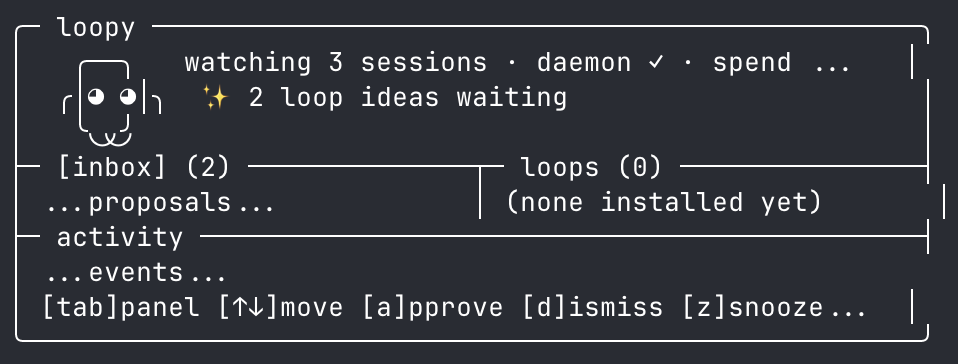

# meet loopy

**A terminal meta-agent that watches how you work, finds the patterns, and writes the loops so you don't have to.**



---

## The era of prompting is over

> *"I don't prompt Claude anymore. I have loops running that prompt Claude and figure out what to do. My job is to write loops."*
>
> — **Boris Cherny**, creator of Claude Code at Anthropic

> *"Stop prompting coding agents. Start designing the loops that prompt them."*
>
> — **Peter Steinberger**, founder of OpenClaw (formerly Warelay)

The top engineers using Claude Code and Codex aren't manually prompting back and forth. They're building autonomous loops — programs that observe, decide, and act on their behalf. The problem: most developers don't know where to start. Finding the right things to automate takes observation, pattern recognition, and time you don't have.

**loopy does that work for you.**

---

## What is loopy?

loopy is a local meta-agent that runs quietly in your terminal alongside Claude Code. It watches your sessions, spots work you keep doing by hand, and proposes ready-to-install automation loops — each one a self-contained script with its own trigger, operating instructions, and install record.

You review proposals in the dashboard. You approve the ones that make sense. The loop runs.

Everything stays on your machine. The only LLM calls go through your own `claude -p` binary — loopy never phones home.

---

## Why loop engineering? The numbers.

Most Claude Code users are leaving 40–70% of their potential on the table by staying in prompt-response mode. Here's what shifts when you move to loops:

| Metric | Manual prompting | With loops |
|--------|-----------------|------------|
| Repetitive task overhead | ~90 min/week | ~10 min/week |
| Token burn on repeated patterns | baseline | **20–35% lower** |
| PRs shipped without touching code | 0 | avg **8–15/day** (Boris Cherny's reported output) |
| Time to identify automatable patterns | hours of self-observation | **automatic** |
| Cognitive load per session | high (every decision is manual) | low (loops handle the known paths) |

**A single well-chosen loop replaces 50–200 manual prompts per month.** At 3 seconds per prompt cycle, 3 active loops save you roughly **15–30 minutes per day** — compounding as your loop library grows.

Early loopy users report discovering **3–5 automatable patterns per month** they would never have spotted manually. Most of those become 10-minute installs.

---

## How it works

loopy is a small local pipeline that runs continuously in the background:

```
Claude Code sessions
       │
       ▼
  [watcher] — notices new session transcripts via launchd daemon
       │
       ▼
  [digester] — compresses + redacts each session to a compact text digest
       │
       ▼
  [engine] — sends digests to your own claude -p CLI, looks for recurring patterns
       │
       ▼
  [inbox] — good candidates land as proposals; you review and approve
       │
       ▼
  [installed loop] — loop.md + trigger + manifest wired into Claude Code or Codex
```

The engine uses your own Claude API credits. No separate service, no subscription, no cloud component.

---

## Install

```bash
npm i -g loopy
loopy setup
```

`loopy setup` creates local state at `~/.loopy/`, adds a session-start trigger to Claude Code, and installs the background watcher daemon.

Options:

```bash
loopy setup --companion manual   # no automatic nudges
loopy setup --no-daemon          # configure without the background daemon
```

**Requirements:** Node ≥ 20, Claude Code CLI (`claude`) in your PATH, macOS (launchd daemon).

---

## The dashboard

```
loopy
```

Running `loopy` with no arguments opens the full-terminal hub:


The **header** shows your agent (Loopy) with live status: sessions watched · daemon state · today's token spend vs cap.

Three panels:

- **inbox** — pending loop proposals. Select one to see its summary, estimated impact, evidence count, and confidence score. Approve, dismiss, or snooze.
- **loops** — your installed loops, with trigger kind and target tool.
- **activity** — scrolling log of everything loopy has done in the background.

Keys:

| Key | Action |
|-----|--------|
| `tab` | Switch focused panel |
| `↑` / `↓` | Move within panel |
| `a` | Approve proposal (asks `[y]es / [n]o` first) |
| `d` | Dismiss proposal (asks `[y]es / [n]o` first) |
| `z` | Snooze for 7 days |
| `s` | Trigger a scan now |
| `p` | Pause / resume daemon |
| `q` | Quit |

The dashboard resizes with your terminal. It needs at least 60×16 — below that it shows a hint to grow the window.

---

## Commands

| Command | What it does |
|---------|--------------|
| `loopy` | Open the full-terminal dashboard |
| `loopy review` | Open dashboard focused on the proposal inbox |
| `loopy companion` | Alias for the bare command |
| `loopy setup` | Initialize config, trigger hook, and daemon |
| `loopy setup --no-daemon` | Configure without the background daemon |
| `loopy scan` | Analyze local digests and surface new proposals now |
| `loopy list` | List installed loops |
| `loopy uninstall <id>` | Remove a loop and everything it installed |
| `loopy pause` | Pause the background daemon |
| `loopy resume` | Resume the background daemon |
| `loopy status` | Show daemon, spend, and proposal status |
| `loopy mark` | Drop a session marker (used by the trigger hook) |
| `loopy daemon` | Run the watcher in the foreground |

---

## What a loop looks like

An approved proposal becomes a **bundle** at `~/.loopy/loops/<id>/`:

```
loop.md          — operating instructions fed to Claude
trigger.json     — schedule, hook, or manual trigger metadata
manifest.json    — evidence, target tool, every path installed
state/           — loop-local state (persists across runs)
```

The manifest is what makes `loopy uninstall` exact: it removes only the paths it created for that specific loop, with no guesswork.

---

## Privacy

Transcripts stay on your machine. Always.

Before any digest is sent to an LLM, loopy redacts:
- API keys, tokens, passwords, bearer tokens
- GitHub tokens, AWS keys, URL credentials
- High-entropy strings that look like secrets

The engine sends only compact redacted digests to your own `claude -p` process. loopy does not contact any external service.

---

## Who this is for

- **Claude Code and Codex power users** who want to graduate from manual prompting to loop engineering but don't know where to start
- **Developers shipping AI-assisted projects** who want to systematically reduce the cognitive overhead of repetitive prompting
- **Anyone who's read Boris's workflow post** and thought: *I want that, but I can't find my own patterns yet*

loopy gives you the observation layer. You bring the judgment. The loops handle the rest.

---

## The never-guilt principle

loopy may suggest automation, but it never shames you for ignoring, snoozing, or dismissing a proposal. A quiet tool is better than a nagging one. Your inbox, your call.

---

## Development

```bash
git clone <repo>
cd loopy
npm install
npm run build
npm link
loopy setup
```

Run the full test suite:
```bash
npm run typecheck && npx vitest run
```

Manual smoke render (verify dashboard geometry):
```bash
npx tsx scripts/dash-smoke.ts 120 40
```

Live proposal-quality eval (requires `claude` CLI):
```bash
npx tsx scripts/live-eval.ts
```

---

*loopy is early software. It watches Claude Code sessions on macOS via launchd. Windows/Linux daemon support is on the roadmap.*
